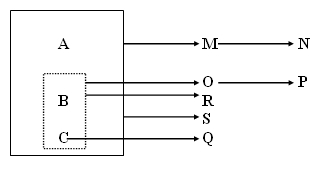

# 3. Dependència Funcional

 
Un atribut o conjunt d'atributs <b>Y</b> depèn funcionalment de l'atribut o
conjunt de atributs <b>X</b> , i es representa com <b>>X → Y</b> , si i només si cada
valor de X es correspon amb un únic valor de Y.  

  

  

Per exemple, entre DNI i NOM existeix una dependència funcional, ja que el
valor DNI es correspon amb un únic nom.

>>>**DNI** →**NOM**

En aquest cas (suposant que el NOM és únic i no existeixen dos noms iguals)
s'acompleix també la dependència

>>>**NOM** →**DNI**

i ho podríem abreviar per

>>>**DNI** ←→**NOM**

No sempre es dóna de forma biunívoca la dependència funcional entre dos
atributs, es més, en pocs casos succeeix. Per exemple, entre els atributs DNI
i ADREÇA existeix una dependència funcional ja que una persona identificada
pel seu DNI viu en una única ADREÇA.

>>>**DNI** →**ADRECA**

Però en aquest cas no es dóna la dependència en sentit invers, perquè en una
ADREÇA viuen unes quantes persones. A més, l'adreça no ens diu ni tan sols la
ciutat on es troba (per exemple, el "C/ Major, 7" es troba en moltes ciutats)

Hi ha atributs que no tenen entre ells una dependència funcional com és el cas
de ADREÇA i DATA_NAIXEMENT.

En moltes ocasions, per a determinar un únic valor d'un atribut, no és
suficient amb conèixer el valor d'un altre atribut, sinó que és necessari
trobar els valors d'uns quants atributs. Això és el que passa, si tenim els
atributs: DNI, EMPRESA i SOU, i sabem que una persona pot treballar en més
d'una empresa. Entre els atributs DNI i SOU no existeix cap dependència
funcional, ja que un individu pot guanyar sous distints en empreses distintes.
Però si coneixem l'empresa en la qual treballa, sí que podem dir que:

>>>**DNI . EMPRESA** →**SOU**

L'operador punt "." representa l'expressió "junt amb" o "i" entre els dos
atributs i l'operador barra "|" fa referència a l'expressió "o també".

Per tant, podem dir que DNI "junt amb" EMPRESA determinen el SOU. I per a la
dependència:

>>>**DNI** →**NOM | ADRECA**

direm que amb el DNI es coneix el NOM "o també" l'ADREÇA.

## 3.2 Dependència Funcional Total

 
Es diu que l'atribut <b>Y</b> té una <b>dependència funcional total</b> de l'atribut
**X** si té una dependència funcional de X i NO depèn funcionalment de cap
subconjunt de X.  

---  
  

Per exemple, una dependència funcional seria:

>>>**DNI . EMPRESA** →**NOM**

Però, lògicament, aquesta dependència no és total ja que NOM depèn
funcionalment de DNI. Per això, a aquesta dependència s'anomena **dependència
parcial**.

La dependència funcional total seria:

>>>**DNI . EMPRESA** →**SOU**

Ara sí, el SOU no depèn funcionalment de cap subconjunt.

És evident que si X està format únicament per un atribut, la dependència
funcional serà total.

Les dependències que ens interessen per a la normalització són sempre les
dependències funcionals totals.

## 3.3 Graf de les Dependències Funcionals

Serveix per a mostrar gràficament la relació existent entre tots els atributs
i és una forma clara de tenir una visió general de les dades i de la cohesió
existent entre elles. La clau principal es representa dins d'una caixa de
línies contínues amb els seus atributs primaris. La resta dels atributs es
representa fora de la caixa.

Si existeixen dependències d'un conjunt d'atributs que no són la clau, aniran
dins d'una caixa de línies discontínues per a no confondre-ho amb la clau
principal de la taula.

**Exemple:**

**A . B . C** →**M | S**  
**M** →**N**  
**B . C** →**O | R**  
**O** →**P**  
**C** →**Q**  
**(clau = A . B . C)**

El graf associat és:

Llicenciat sota la  [Llicència Creative Commons Reconeixement NoComercial
SenseObraDerivada 3.0](http://creativecommons.org/licenses/by-nc-nd/3.0/)

