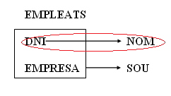
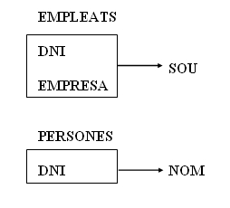

# 4. Segona Forma Normal (2FN)

Una taula es diu que està en _2FN_ si i només si compleix dues condicions:

  * **Es troba en 1FN.**
  * **Tot atribut secundari (aquells que no pertanyen a la clau principal, els que es troben fora de la caixa) depèn totalment (té una dependència funcional total) de la clau completa i, per tant, no d'una part d'ella.**

  
---  
  
Aquesta forma normal només es considera si la clau principal és composta, i
per tant, està formada per diversos atributs.

Si una taula **T** té com a atributs **A, B, C, D** i la clau és **A . B**
complint-se les dependències:

**A . B** →**C**

**B** →**D**

S'observa que la taula no es troba en 2FN ja que l'atribut D no té una
dependència funcional total amb la clau completa A . B , sinó amb una part de
la clau (B). El graf de les dependències funcionals seria:  

****

**Si existeix una fletxa que ix de l'interior de la caixa que engloba la clau,
aleshores la taula no està en 2FN.**
****

**<u>Posar en 2FN</u>**

Per a convertir una taula que no està en segona forma normal a 2FN, es
realitza una projecció i es crea:

**A)** Una **primera taula** amb la clau i totes les seues dependències totals
amb els atributs secundaris afectats:

>   
>

****

**B)** Una **segona taula** amb la part de la clau que té dependències, i els
atributs secundaris implicats:

> 

****

> La clau de la nova taula T2 serà l'antiga part de la clau.

**Exemple** : Taula amb les persones que treballen en diverses empreses amb
el sou corresponent, amb els atributs:**DNI , NOM , EMPRESA , SOU**

Entre els atributs existeixen les dependències:

****

**DNI** →**NOM**

**DNI . EMPRESA** →**SOU**

El graf que mostra les dependències és el següent:

És evident que la taula no es troba en 2FN, després de normalitzar s'obté:

****

****

Llicenciat sota la  [Llicència Creative Commons Reconeixement NoComercial
SenseObraDerivada 3.0](http://creativecommons.org/licenses/by-nc-nd/3.0/)

