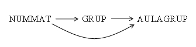

# 5. Dependència Funcional Transitiva

La dependència funcional transitiva s'aplica per a analitzar les taules en
tercera forma normal (3FN). Consisteix bàsicament a considerar que **un
atribut no primari només ha de conèixer-se a través de la clau principal o
claus secundàries**. En un altre cas, estarà produint redundància d'informació
amb les anomalies típiques que porta amb ella.

 
Suposem tres subconjunts distints d'atributs A , B i C que pertanyen a una
taula T, de manera que es compleixen les condicions:  <b>A</b> → <b>B</b> i <b>B</b>
−∕→ <b>A</b> Es diu que C té una <b>dependència funcional transitiva</b> amb A o que
és transitivament dependent de A si es compleix que <b>B</b> →<b>C</b> 

 
---  
  
Gràficament es pot mostrar:

Per tant, un atribut C és transitivament dependent d'un altre A si es coneix
per diferents vies, una directament, i una altra a partir d'un altre atribut
intermedi B.

Per exemple, considerem tres atributs que formen part de la taula ALUMNES:

* NUMMAT = núm. de matrícula.
* GRUP = Grup assignat.
* AULAGRUP = Aula assignada al grup.

>>> **NUMMAT** →**GRUP | AULAGRUP**

>>> **GRUP** →**AULAGRUP**

  
L'atribut AULAGRUP és transitivament dependent de NUMMAT, ja que es pot
conèixer per mig de l'atribut NUMMAT i a través de l'atribut GRUP

Llicenciat sota la  [Llicència Creative Commons Reconeixement NoComercial
SenseObraDerivada 3.0](http://creativecommons.org/licenses/by-nc-nd/3.0/)

