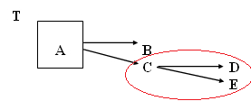
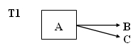
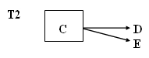
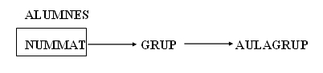
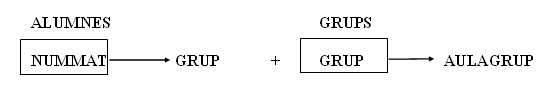

# 6. Tercera Forma Normal (3FN)

 
Una taula es diu que està en 3FN si i només si es compleixen dues
condicions:
<ul>
  <li>Es troba en 2FN.</li>
  <li>No existeixen atributs no primaris (atributs que no formen part de la clau principal) que són transitivament dependents de cada clau candidata de la taula.</li>
</ul>

  
---  
  
Açò vol dir que un atribut secundari només es pot conèixer a través de la clau
principal o claus candidates de la taula i no per mig d'un altre atribut no
primari.

En el graf de dependències només han de mostrar-se les dependències
transitives i no aquelles dependències funcionals a partir de les claus
candidates, perquè se sap que per ser claus ja coneixen tots els atributs.

Exemple: A és la clau principal, B és una clau candidata i es donen les
següents dependències:

**A** →**B B** →**A C** →**D**

**A** →**C B** →**C C** →**E**

**A** →**D B** →**D**

**A** →**E B** →**E**

El graf queda del següent mode:  

   O bé      

  

Les fletxes que mostren les dependències funcionals que té la clau candidata B
no es representen (com hem dit anteriorment) perquè són evidents i no
simplifiquen la visió del graf. A més a més, per a la normalització, no es
necessiten per a res; pel contrari, solen complicar l'anàlisi.

La taula T no està en 3FN ja que els atributs D i E són transitivament
dependents respecte de la clau A.

**<u>Posar en 3FN</u>**

Per a normalitzar una taula que no estiga en tercera forma normal, és a dir,
que tinga dependències transitives, descompondrem la taula en més d'una taula:

**A)** Una **primera taula** amb la clau principal més els atributs que no
depenen transitivament

> 

**B)** Una **segona taula** amb els atributs que depenen transitivament, més
l'atribut de qui depenen, que serà clau principal

>   
>

Es farà una descomposició per cada dependència transitiva que hi haja que
afecte a camps distints.

Per a l'exemple dels atributs NUMMAT, GRUP i AULAGRUP tenim el següent graf:

  

  

Una vegada descomposta la taula en dos segons l'algoritme anterior, tindrem
dues taules

****

Les dues taules resultants sí que es troben en 3FN.

Llicenciat sota la  [Llicència Creative Commons Reconeixement NoComercial
SenseObraDerivada 3.0](http://creativecommons.org/licenses/by-nc-nd/3.0/)

