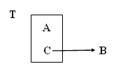
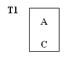
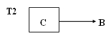
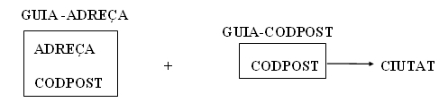

# 7. Forma Normal Boyce-Codd (FNBC)

Després de la creació de la 3FN es va observar, posteriorment, que podien
haver anomalies que no eren abordades. De tota manera són unes redundàncies ja
molt extranyes, i que de vegades no valdrà la pena considerar-les.  

Són casos de taules que encara que estan en 3FN, mantenen una dependència d'un
atribut secundari amb part de la clau. És l'únic cas de dependència transitiva
que se'ns podia haver escapat. Gràficament és el següent cas:

 
Una taula T està en FNBC si i només si està en 1FN i les úniques
dependències funcionals elementals són aquelles en les quals la clau principal
(i claus candidates) determinen un atribut.

---  
  

La definició engloba la 3FN ja que les dependències transitives existeixen per
mig d'atributs secundaris que no eren clau.

Si la clau està formada per un únic atribut i ja estava en 3FN, la taula està
en FNBC (com succeïa amb la 2FN).

<u>**Exemple**</u> : Taula d'una guia de carrers

**GUIA DE CARRERS**

**<u>ADREÇA</u>** |  **<u>CIUTAT</u>** |  **CODPOST**  
---|---|---  
C/ Pez, 2  |  Benicarló  |  12580   
C/ Luz, 5  |  Benicarló  |  12580   
C/ Mar, 4  |  Castelló  |  12005   
C/ Sol, 4  |  Vinaròs  |  12500   
C/ Sal, 9  |  Castelló  |  12004   
C/ Mar, 4  |  Vinaròs  |  12500   
  
Les dependències funcionals que ens trobem són:

**ADREÇA . CIUTAT** →**CODPOST**

**CODPOST** →**CIUTAT**

Gràficament:

Si observem atentament les tuples d'una taula com aquesta, veurem que per a un
mateix codi postal existeixen multitud de tuples que es corresponen amb la
mateixa ciutat (tantes com adreces hi haja diferents), per tant existeix
informació duplicada.

Si la informació, una vegada que es dóna d'alta no varia, és més rendible que
la dependència funcional **CODPOST** → **CIUTAT** es trobe en una altra taula
i que existisca una sola tupla per a cada codi postal.

A més a més, què succeeix si s'elimina la tupla amb adreça "C/ Sol, 4" de
"Vinaròs" i la tupla "C/ Mar, 4" de "Vinaròs"? El que ocorre és que desapareix
la relació entre el codi postal "12500" i "Vinaròs" i potser aquestes dades
haurien de mantenir-se.

Si analitzem amb més detall la taula, veuríem que en realitat es pot
substituir la clau principal per **A + C** (en l'exemple **ADREÇA +
CODPOSTAL**), ja que si A + B ja era clau principal, com per cada valor de C
només podem tenir un de B, la combinació A + C també podrà identificar
unívocament cada ocurrència de la taula. Per tant, si substituirem la clau
principal, ja no tindríem dubtes de com normalitzar la taula, que serà
justament com veurem a continuació:

  és equivalent a     
  

**Posar en FNBC**

L'algoritme de descomposició que s'aplica a una taula que no està en FNBC és
el següent:

Si tenim una dependència funcional **C → B** on **C** i **B** són disjunts,
**C** és una atribut no primari, i **B** forma part de la clau.

S'obtenen les projeccions:

> **A)** Una **primera taula T1** amb tots els atributs, excepte **B** (el que
> formava part de la clau principal); ara formarà part de la clau principal
> **C**.

> **B)** Una **segona taula T2** amb els atributs **C** i **B** , i serà la
> clau principal **C**

En l'exemple inicial d'aquesta pregunta quedarà:

**A)**  

    

**B)** 

    
  
En l'exemple de la GUIA DE CARRERS:

I quedarien amb la següent informació:

**GUIA-ADREÇA**

| **<u>ADREÇA</u>** |  **<u>CODPOST</u>** 
---|---
C/ Pez, 2  |  12580   
C/ Luz, 5  |  12580   
C/ Mar, 4  |  12005   
C/ Sol, 4  |  12500   
C/ Sal, 9  |  12004   
C/ Mar, 4  |  12500     

**GUIA-CODPOST**

| **<u>CODPOST</u>** |  **CIUTAT**  
---|---  
12004  |  Castelló   
12005  |  Castelló   
12500  |  Vinaròs   
12580  |  Benicarló   
  

Per últim, observem les taules que ens queden. Voldrem tenir una taula de
codis postals? Si el disseny és per a Correus o Telefònica, o una empresa gran
que tinga molts client i els vol tenir distribuïts per codis postals, doncs
segur que sí.

Però si es tracta d'una empresa no massa gran, i que tampoc interessa massa la
distribució per codis postals, segurament mantenir una taula de codis postals
pot semblar fins i tot ridícul. Aleshores, mantenir la taula en 3FN i assumir
la miqueta de redundància que suposa no tenir-la en FNBC, pot ser fins i tot
saludable. Per això s'ha comentat des del principi del tema la importància de
normalitzar fins la 3FN, i la FNBC té una importància relativa.

De manera que la representació de les taules al **model relacional** quedaria de la manera següent:
<pre><cod>
    GUIA-ADREÇA(<b>adreça,codpos</b>)
    GUIA-CODPOST(<b>codpost</b>,ciutat)
</cod></pre>
****

Llicenciat sota la  [Llicència Creative Commons Reconeixement NoComercial
SenseObraDerivada 3.0](http://creativecommons.org/licenses/by-nc-nd/3.0/)

