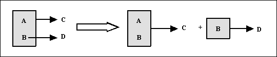
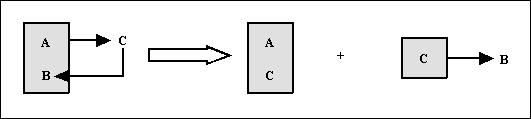

# Resum

**<u>1FN</u>**  

  
Una taula està en 1FN si i només si els valors que componen els atributs
d'una tupla són atòmics.

Es descompon la taula en dos

> 1a.- Projecció de la clau junt amb els atributs que tenen valors atòmics.

> 2a.- Nova clau amb els atributs que tenen valors múltiples (cal idear una nova
clau).

**<u>2FN</u>**  
  

 
Una taula es diu que està en 2FN si i només si compleix dues condicions:
<ul>
    <li>Es troba en 1FN.</li>
    <li>Tot atribut secundari (aquells que no pertanyen a la clau principal, els que es troben fora de la caixa) depèn totalment (té una dependència funcional total) de la clau completa i, per tant, no d'una part d'ella.</li>
</ul>    

Es descompon la taula en dos

> 1a.- Una taula amb la clau i totes les seues dependències totals.

> 2a.- Una altra taula amb la part de la clau que té dependències, i els
> atributs secundaris implicats.

**<u>3FN</u>**  
  

 
Una taula es diu que està en 3FN si i només si es compleixen dues
condicions:
<ul>
  <li>Es troba en 2FN.</li>
  <li>No existeixen atributs no primaris (atributs que no formen part de la clau principal) que són transitivament dependents de cada clau candidata de la taula.</li>
</ul>

  

Es descompon la taula en dos

> 1a.- Una taula amb la clau i tots els atributs no primaris que no són
> transitius.

> 2a.- Una altra taula amb els atributs transitius i l'atribut no primari (que
> serà la clau de la nova taula).

**<u>FNBC</u>**  
  

 
Una taula T està en FNBC si i només si està en 1FN i les úniques
dependències funcionals elementals són aquelles en les quals la clau principal
(i claus candidates) determinen un atribut.

Es descompon la taula en dos

> 1a.- Una taula amb tots els atributs menys la part de la clau dependent de
> l'atribut secundari. La clau està formada per la resta de la clau i
> l'atribut secundari del que depenia part de la clau.

> 2a.- Una altra taula en què l'atribut de què depèn part de la clau serà la
> nova clau i aquesta part de la clau com a atribut secundari.

Llicenciat sota la  [Llicència Creative Commons Reconeixement NoComercial
SenseObraDerivada 3.0](http://creativecommons.org/licenses/by-nc-nd/3.0/)

