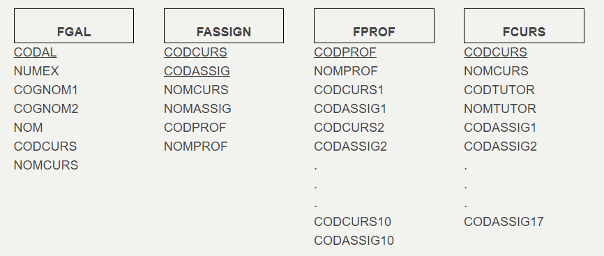

# Exercicis

##   Exercici 1

Normalitzar la taula relacional que té com a graf de dependències funcionals
el següent:

Podeu normalitzar-ho tot directament, sense haver de passar primer per 2FN ,
3FN i FNBC.

##  Exercici 2

En un Institut tenen distribuïda la informació en els següents fitxers:

  
Normalitzeu els fitxers, si els considerem taules d’una Base de Dades. Heu de
parar especial atenció a veure si està en 1FN.

##  Exercici 3

La factura d'un hotel és la següent:

  
Si considerem tota la informació en una única taula tindrem:

  
Intenteu normalitzar-la. Pareu especial atenció aveure si està en 1FN.

Llicenciat sota la  [Llicència Creative Commons Reconeixement NoComercial
SenseObraDerivada 3.0](http://creativecommons.org/licenses/by-nc-nd/3.0/)

